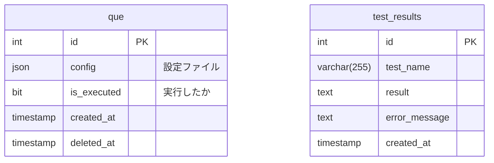

```mermaid
erDiagram
  que {
    int id PK
    json config "設定ファイル"
    bit is_executed "実行したか"
    timestamp created_at
    timestamp deleted_at
  }
  test_results{
    int id PK
    varchar(255) test_name
    text result
    text error_message
    timestamp created_at
  }
```
